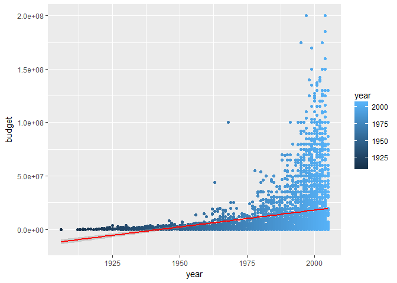

Regressão Linear para predição de Nota IMBD
================

Documento
---------

Esse documento tem como objetivo formalizar um API para predição de notas imbd através de um banco de dados fornecido pelo pacote `ggplot2movies`. Nele trabalharemos a exposição das notas e função

Libraries
---------

Importamos as seguintes Libraries de início, caso não tenha instalado use a função `install.packges()`:

("ggplot2movies") ("tidyverse")

Após instalar:

``` r
library(tidyverse)
```

    ## Loading tidyverse: ggplot2
    ## Loading tidyverse: tibble
    ## Loading tidyverse: tidyr
    ## Loading tidyverse: readr
    ## Loading tidyverse: purrr
    ## Loading tidyverse: dplyr

    ## Conflicts with tidy packages ----------------------------------------------

    ## filter(): dplyr, stats
    ## lag():    dplyr, stats

Fazemos a importação do banco de dados

``` r
prime <- ggplot2movies::movies
```

Criaremos um modelo simples através do ano de lançamento e a "budget", orçamento, do filme apenas. selecionamos e mineramos os dados com o uso de pipe. Caso não conheça a ferramenta recomendo fortemente:

-   [Use pipe](http://r4ds.had.co.nz/pipes.html)

``` r
dados <- ggplot2movies::movies %>% 
  filter(!is.na(budget), budget > 0) %>% 
  select(title, year, budget, rating) %>% 
  arrange(desc(year))

dados
```

    ## # A tibble: 5,183 x 4
    ##                           title  year   budget rating
    ##                           <chr> <int>    <int>  <dbl>
    ##  1                           90  2005     4000    9.1
    ##  2              Alien Abduction  2005   600000    1.9
    ##  3     All the Stage Is a World  2005    12000    7.0
    ##  4            Alone in the Dark  2005 20000000    2.1
    ##  5       Amityville Horror, The  2005 18000000    5.8
    ##  6                  And I Lived  2005    20000    9.4
    ##  7            Are We There Yet?  2005 32000000    3.5
    ##  8                Ash Wednesday  2005     4999    8.6
    ##  9       Assault on Precinct 13  2005 20000000    6.3
    ## 10 Ballad of Jack and Rose, The  2005  1500000    6.2
    ## # ... with 5,173 more rows

Modelo de predição
------------------

Avaliaremos dois modelos, a fim de exemplificar a utilidade de conhecer sobre as fórmulas de regressão e quão importante são.

### Primeiro modelo

`y~x1+x2`

Os dois modelos são simples, e veremos as diferenças. Usamos a função `lm()` para

``` r
modelo <- lm(rating ~ budget + year, data = dados)
summary(modelo)
```

    ## 
    ## Call:
    ## lm(formula = rating ~ budget + year, data = dados)
    ## 
    ## Residuals:
    ##     Min      1Q  Median      3Q     Max 
    ## -5.2325 -0.9537  0.1408  1.0482  3.9507 
    ## 
    ## Coefficients:
    ##               Estimate Std. Error t value Pr(>|t|)    
    ## (Intercept)  1.501e+01  2.040e+00   7.355 2.20e-13 ***
    ## budget       3.645e-10  9.570e-10   0.381    0.703    
    ## year        -4.469e-03  1.029e-03  -4.342 1.44e-05 ***
    ## ---
    ## Signif. codes:  0 '***' 0.001 '**' 0.01 '*' 0.05 '.' 0.1 ' ' 1
    ## 
    ## Residual standard error: 1.541 on 5180 degrees of freedom
    ## Multiple R-squared:  0.003793,   Adjusted R-squared:  0.003408 
    ## F-statistic: 9.861 on 2 and 5180 DF,  p-value: 5.318e-05

Vemos aqui a correlação entre a nossa variável de interesse (rating) e o ano (year) de lançamento. R-quadatico ajustado está com um valor baixo assim como o p-value.

### Segundo modelo

`y~x1+x2+x1*x2`

Mas usamos outro modelo para nossa formula. Que tal avaliarmos a relação não só do ano com a variavel de interesse e do orçamento com a variavel de interesse, mas também do ano em relação ao orçamento:

``` r
modelo2 <- lm(rating ~ budget * year, data = dados)
summary(modelo2)
```

    ## 
    ## Call:
    ## lm(formula = rating ~ budget * year, data = dados)
    ## 
    ## Residuals:
    ##     Min      1Q  Median      3Q     Max 
    ## -5.1968 -0.9425  0.1461  1.0555  3.9559 
    ## 
    ## Coefficients:
    ##               Estimate Std. Error t value Pr(>|t|)    
    ## (Intercept)  1.350e+01  2.099e+00   6.434 1.36e-10 ***
    ## budget       9.392e-07  3.125e-07   3.005 0.002666 ** 
    ## year        -3.722e-03  1.058e-03  -3.518 0.000439 ***
    ## budget:year -4.695e-10  1.563e-10  -3.004 0.002676 ** 
    ## ---
    ## Signif. codes:  0 '***' 0.001 '**' 0.01 '*' 0.05 '.' 0.1 ' ' 1
    ## 
    ## Residual standard error: 1.54 on 5179 degrees of freedom
    ## Multiple R-squared:  0.005526,   Adjusted R-squared:  0.00495 
    ## F-statistic: 9.592 on 3 and 5179 DF,  p-value: 2.59e-06

Notamos o valor do p-value menor assim como o F-test de maior confiança. Opa! já parece melhor. Nota: A formula apresentada no modelo é igual a `y~x1*x2`. Esse modelo é equivalente a `y~x1+x2+x1*x1` em R.

Visualizando os dados
---------------------

Vamos visualizar o que estamos fazendo, assim como a nossa base de dados se comporta:

``` r
ggplot(dados, aes(y = rating, x = budget)) + 
  geom_point(aes(colour = year)) +
  geom_smooth(method = "lm", colour="red")
```


Uma análise critica dos dados é que o orçamento vem aumentando com o tempo, e que as notas vêm caindo também. Uma explicação seria que o público está mais crítico e/ou o maior número de filmes traz essa sensação. Note que notas muito baixas são raras com o incremento do orçamento.

``` r
ggplot(dados, aes(y = budget, x = year)) + 
  geom_point(aes(colour = year)) +
  geom_smooth(method = "lm", colour="red")
```



Nessa abordagem vemos que uma função linear não é a melhor descrição. Vemos o aumento exponencial do orçamento despendidos em filmes.

#### Lembre-se!

A regressão linear apresentada nos gráficos não é a mesma do nosso modelo, porém é válido vermos a tendência. Isso quer dizer que, no segundo gráfico é a representação dos termos `x1:x2` em um modelo onde não apresentaria os termos `x1+x2`. E vale para o primeiro gráfico para o fator beta1 de x1 em um modelo onde não possuímos o `x2` e `x1:x2`.

Prevendo uma Nota
-----------------

Para usar nosso modelo como forme de predição criaremos uma função que poderá ser exportada se necessário. A predição é uma entrada simples de dois valores: (year,budget)

``` r
funcao_que_preve <- function(orcamento, ano) {
  predict(modelo, newdata = data.frame(budget = orcamento, year = ano))
}
```

Para usar é simples basta rodar a função. Vamos tentar um filme de 2011 com budget de 10000:

`funcao_que_preve(10000,2011)`

Vamos ver onde está nossa nota prevista no meio disso tudo:

``` r
my_rt <- as.numeric(funcao_que_preve(10000,2011))
my_rt
```

    ## [1] 6.017972

Essa é nossa predição

``` r
ggplot(dados, aes(y = rating, x = budget)) + 
  geom_point(aes(colour = year)) +
  geom_smooth(method = "lm")+
  geom_point(x=10000,y=my_rt,colour="red", size=2)
```


Pronto. Modelo simples, fácil e ótimo para aprender!!!

Referencia
==========

Vinicius Lucena [Github](https://github.com/viniciuslucenasouza) [Linkedin](https://www.linkedin.com/in/vinicius-lucena/)
